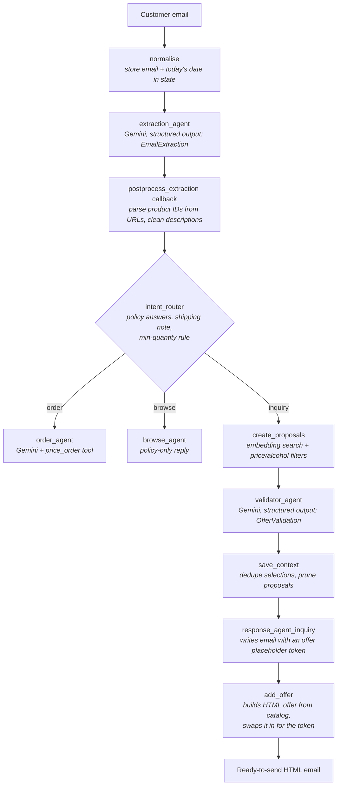

# Email Response Agent

A multi-agent workflow built with **Google ADK** that reads incoming customer email, works out what the client wants, finds matching products in the catalog, and produces a **ready-to-send HTML reply** with a tailored product offer and answers to the client's policy questions.

It was built around the catalog and inquiry patterns of **Fabulosa** ([fabulosa.pl](https://fabulosa.pl)), a Polish retailer of corporate gift baskets. During the Christmas season the sales team gets a flood of similar emails: *"30 non-alcoholic baskets up to 150 zł, can you deliver to several addresses?"* Each one used to need a person to read it, search the catalog, check prices and policy, and write a reply. This workflow automates that whole loop.

Because of the fact that this was created as a product for a business, the whole code won't be shown. This is an overview of a project. 

---

## Table of contents

1. [What it does](#what-it-does)
2. [Architecture](#architecture)
3. [Step-by-step walkthrough](#step-by-step-walkthrough)
4. [Key design decisions](#key-design-decisions)
5. [Data models (`classes.py`)](#data-models-classespy)
6. [Business rules encoded in code](#business-rules-encoded-in-code)
7. [Project structure](#project-structure)
8. [Tech stack](#tech-stack)
9. [Setup and running](#setup-and-running)
10. [Examples](#examples)
11. [Known limitations and roadmap](#known-limitations-and-roadmap)

---

## What it does

Given a raw customer email, the workflow:

1. **Extracts** structured requirements for each product: quantity, budget range, net or gross price, per piece / per person / total, whether the budget includes delivery, alcohol requirements, and delivery method.
2. **Classifies intent** into one of three paths:
   - `order`: the client names specific catalog products (code, exact name or link) with quantities
   - `inquiry`: the client describes what they want and asks for a proposal
   - `browse`: the client only asks general questions (logistics, possibilities)
3. **Answers policy questions** (discounts, lead time, personalization, greeting cards, payment, international delivery, multiple addresses) from a fixed company policy, never from the model's imagination.
4. **Applies business rules in code**: seasonal minimum order quantities and tiered shipping costs.
5. For inquiries, **finds products** with semantic search over the catalog, filtered by budget and alcohol rules, then has a second LLM **verify** that each product's real contents match the request.
6. **Writes the reply**: the LLM writes only the conversational text, and the product offer (names, prices, images, links) is generated in code from the catalog and inserted into the email.

---

## Architecture



The graph is defined declaratively at the bottom of `agent.py`:

```python
root_agent = Workflow(
    name="email_reponse_workflow",
    edges=[
        ("START", normalise, extraction_agent),
        (extraction_agent, intent_router),
        (intent_router, {"order": order_agent,
                         "inquiry": create_proposals,
                         "browse": browse_agent}),
        (create_proposals, validator_agent, save_context,
         response_agent_inquiry, add_offer),
    ],
)
```

LLM nodes and plain Python nodes are mixed in one graph. Each step uses whichever tool fits: the LLM where language understanding is needed, and code where the answer must be exact and we want to maximize the determinism of outputs. 

---

## Step-by-step walkthrough

### 1. `normalise` (Python)
Puts the raw email (`clients_email`) and today's date (`todays_date`) into the shared session state, so every later agent can refer to them in its prompt template.

### 2. `extraction_agent` (LLM: `gemini-3.5-flash`)
Turns email text into an `EmailExtraction` object (see [data models](#data-models-classespy)). The system prompt covers the edge cases that came up in real inquiries:

- **Separate constraints for each product.** "30 pcs up to 150 zł and 10 pcs up to 200 zł" becomes two products with different `price_max` values. One budget for the whole email is applied to every product.
- **Logistics splits are not product splits.** "19 sets to individual addresses and 11 to our warehouse" stays one product with `quantity = 30`. Products are only split when they differ in price or type.
- **Reference products.** "Something similar to SU42, SU44 and MC37" turns each referenced product into its own search entry with the same constraints, instead of collapsing them into one vague description.
- **Intent decided in a fixed order.** Specific products with quantities count as `order`, even if the client writes "I'm interested" or asks about price. A description or a request for a proposal counts as `inquiry`, even if the client uses the word "order". Everything else is `browse`.
- **Defaults.** An unspecified price basis is gross (`brutto`). A range such as "160–170 zł" becomes `price_min` / `price_max`.

### 3. `postprocess_extraction` (after-model callback)
Runs on the raw model output before it leaves the agent:

- Pulls the numeric `product_id` out of any `fabulosa.pl` product URL with a regex.
- Removes stray URLs from `description` fields, so the semantic search embeds only meaningful text.
- If the model's JSON is malformed, the callback **passes it through unchanged** instead of swallowing the error. ADK's own schema validation then reports the real problem, rather than it being hidden.

### 4. `intent_router` (Python)
This is a plain Python node with no LLM involved. It:

- Looks up a fixed answer for every policy question the client asked (`policy_info`).
- Adds up total quantity and computes the **shipping note** for that exact order size.
- Checks the **high-season minimum quantity** (10 pcs per product, September–February) and lists exactly which products fall below it.
- Saves all of this to state as `policy_info` and routes to `order`, `inquiry` or `browse`.

Because these facts are computed in code, the LLMs further down only *phrase* them and never have to calculate them.

### 5a. `create_proposals` (Python, inquiry path)
For each requested product (described or referenced by name):

- **Builds a price window.** If only a maximum is given, the minimum defaults to 80% of it, so the offer isn't padded with very cheap items. If the budget includes delivery, the delivery cost is subtracted first.
- **Runs semantic search** over the catalog with OpenAI `text-embedding-3-large`. Catalog embeddings are precomputed (`vectors_openai.npy`), so only the query is embedded at run time. The search is filtered by price window, net/gross basis and alcohol rule, and returns the top 5 candidates with name, description and net price.
- Stores the candidate groups in state as `proposals`.

### 5b. `validator_agent` (LLM: `gemini-3.1-flash-lite`)
A second, cheaper model acts as a reviewer. For each group it reads the **actual contents** of each candidate, not just the product name, and decides whether it matches the client's request. Its rules:

- If the client wants no alcohol, any product whose contents include wine, whisky, liqueur and so on is rejected, **even if the name suggests otherwise**.
- If the client needs a specific ingredient (a particular alcohol, coffee, tea, a colour), only products that actually contain it are accepted.
- It may only return codes it saw **in that specific group**, never invented codes or codes moved over from another group.
- Groups are identified by `group_index`, not by `label`, because two groups can have identical labels (same request, different quantities).
- It always returns at least one product and adds a note if the match is imperfect.
- Unless Easter is mentioned, Christmas is assumed and Easter products are not proposed.
- It gives one sentence of reasoning for each accept or reject decision, so its choices can be audited.

Output is the structured `OfferValidation` model.

### 6. `save_context` (Python)
- **`dedupe_selections`** removes duplicate groups (same label, quantity and set of codes). It also stops the same product being offered twice across groups: a code already shown in an earlier group is removed from later ones.
- Prunes `proposals` down to the accepted codes only.
- Saves the final selections as `for_offer`.

### 7. `response_agent_inquiry` (LLM: `gemini-3.5-flash`)
Writes the email body in the voice of the sales department (formal Polish, first person plural), following a fixed structure: greeting, thanks, **a line containing only the `{Offer here}` token**, minimum-quantity note, policy answers in separate paragraphs, closing.

It is explicitly forbidden from writing prices, product names, codes or links, and from saying that "the offer will follow later", because the offer is part of this same email (This happened multiple times when it wasn't specified in the instruction).

### 8. `add_offer` (Python)
- Splits the model's text at the `{Offer here}` token.
- Builds the grouped HTML offer (`build_grouped_offer`) directly from `catalog.parquet` using the validated codes: product names, prices, images and links.
- Joins everything into one HTML email (`text before + offer + text after`)

### Other paths
- **`browse_agent`** replies to general questions using only the company policy text and the computed facts.
- **`order_agent`** replies to direct orders and can call the **`price_order`** tool to get the price of each line item and the order total.

---

## Key design decisions

### 1. The LLM writes the words; code writes the offer
The response model never generates the product offer. It writes the conversational part of the email around a placeholder token, and the offer is rendered in code from catalog data and swapped in afterwards.

- **Lower token usage.** The longest and most repetitive part of the email (product blocks with prices, links and images) is never produced by the model, so output tokens stay small regardless of how many products are offered.
- **No invented prices or products.** Every price, code, link and image comes straight from the catalog. The model has no opportunity to invent a number.
- **Consistent formatting.** The offer looks the same every time because it is a template, not generated text.

### 2. Deterministic facts, generative phrasing
Anything with a correct answer is computed in Python: shipping cost for the given quantity, seasonal minimum quantities, the list of products below the minimum, and the policy answer for each question. The LLM receives these as **"facts calculated by the system; pass them on, do not calculate anything yourself."** This keeps the parts the business can be held to separate from the parts that are just wording.

### 3. Structured outputs everywhere
Both LLM decision points (extraction and validation) return **Pydantic models**, not free text. This gives type-checked data between nodes, makes routing logic simple, and turns model mistakes into visible validation errors instead of silent misbehaviour. The policy-question `Literal` type uses the same keys as the `policy_info` dictionary, so the model can only ask for answers that exist.

### 4. Retrieve, then verify
Embedding search is fast and good at "sounds similar", but it can't reliably tell "Christmas basket **with** wine" from "Christmas basket **without** wine". So retrieval is followed by a cheap LLM verification step that reads the actual product contents. Hard constraints (price, alcohol flag) are applied as filters *before* the search results are returned, and softer constraints (ingredients, colour, occasion) are checked by the validator.

### 5. Right-sized models
The extraction and reply-writing steps use `gemini-3.5-flash`, where understanding and fluent Polish matter. Validation, a narrower yes/no task over a short list, uses the cheaper `gemini-3.1-flash-lite`.

### 6. Prompts built from real failure cases
The extraction prompt is a record of edge cases found while testing on realistic emails: logistics splits that looked like product splits, the word "order" used in inquiries, reference products being merged into one, greeting cards confused with personalization, budgets that include delivery. Each rule exists because a real-style email broke an earlier version.

---

## Data models (`classes.py`)

| Model | Purpose | Key fields |
|---|---|---|
| `Product` | One requested product and its constraints | `url`, `name`, `description`, `quantity`, `alcohol` (`any` / `none` / `required` / `specific`), `alcohol_detail`, `price_min`, `price_max`, `price_basis` (`netto` / `brutto`), `price_per` (`piece` / `person` / `total`), `price_includes_delivery`, `delivery`, `product_id`, `code` |
| `EmailExtraction` | Full parsed email | `products: List[Product]`, `deadline`, `policy_questions`, `intent` (`order` / `inquiry` / `browse`) |
| `GroupSelection` | Validator's choice for one product group | `label`, `group_index`, `quantity`, `codes` |
| `OfferValidation` | Validator's full output | `selections`, `reasoning`, `note` |

Field descriptions inside the models (for example *"Never set price_min equal to price_max"*) are passed to the model as part of the output schema, so they work as extra instructions right where the field is filled in.

---

## Business rules encoded in code

| Rule | Implementation |
|---|---|
| High-season minimum quantity: 10 pcs per product (Sep–Feb) | `MIN_QTY_HIGH_SEASON`, `HIGH_SEASON_MONTHS`, checked in `intent_router` |
| Shipping: ≤ 6 pcs → 20 zł transfer / 26.50 zł cash on delivery | `shipping_note()` |
| Shipping: 7–12 pcs → 40 zł / 45 zł | `shipping_note()` |
| Shipping: > 12 pcs → priced individually | `shipping_note()` |
| Budget "including delivery" → delivery cost subtracted before searching | `create_proposals` (`delivery_price = 20`) |
| Price floor when only a maximum is given → 80% of maximum | `create_proposals` (`perc = 0.8`) |
| Policy answers (discount threshold, lead time, personalization, cards, payment, international, multiple addresses) | `policy_info` dictionary |

---

## Project structure

Recall that only 3 files from the project are in this repository.

```
.
├── agent.py            # Workflow graph, LLM agents, prompts, routing and post-processing nodes
├── classes.py          # Pydantic data models shared across the workflow
├── node_offer.py       # create_proposals: price windows, alcohol mapping, semantic search per product
├── product_lookup.py   # search_by_description_openai: embedding search with filters
├── create_offer.py     # build_grouped_offer: renders the HTML offer from catalog rows
├── render_html.py      # LLM text → HTML
├── finding_prices.py   # price_order tool used by order_agent
├── catalog.parquet     # Product catalog (code, name, description, prices, alcohol flags, images, links)
├── vectors_openai.npy  # Precomputed catalog embeddings (text-embedding-3-large)
└── examples/           # Sample emails and the generated replies
```

---

## Tech stack

- **Google ADK** (`Workflow`, `Agent`, callbacks, session state): graph-based orchestration of LLM and Python nodes
- **Gemini** (`gemini-3.5-flash`, `gemini-3.1-flash-lite`): extraction, validation, reply writing
- **OpenAI embeddings** (`text-embedding-3-large`): semantic product search
- **Pydantic**: structured LLM outputs and data validation
- **pandas / NumPy / Parquet**: catalog storage and vector search
- **python-dotenv**: API key management

---

## Setup and running

The setup here won't be shown because this is an overview of the project and lack of necessary files will prevent anybody from successfully run the code. 

## Examples

The `examples/` folder holds end-to-end runs. Each example contains a print screen of the website with the clients email and the response. 

---

## Known limitations and roadmap

- **Evaluation set.** Build a labelled set of real-style emails to measure extraction accuracy and intent classification as prompts change. 
